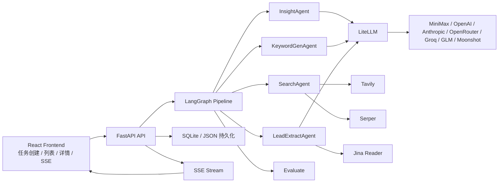
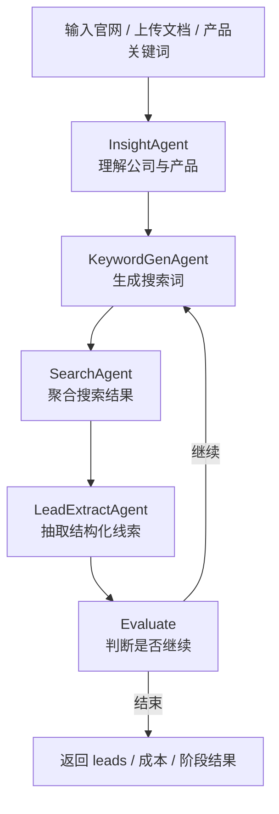

# AI Hunter

> 面向外贸与 B2B 场景的自动化客户挖掘系统，基于 FastAPI、LangGraph、多 Agent 流水线与可配置多模型能力。

[](https://python.org)
[](https://fastapi.tiangolo.com)
[](https://react.dev)
[](https://github.com/langchain-ai/langgraph)

AI Hunter 是一个面向外贸与 B2B 线索挖掘场景的开源版项目。你只需要提供公司官网、产品文档或产品关键词，再指定目标市场，系统就会自动完成公司理解、关键词生成、网页搜索、线索提取和联系方式发现。

## 官方链接

- 官网：https://b2binsights.io/
- 视频介绍：https://www.bilibili.com/video/BV1AzwYzXEGD/?spm_id_from=333.1387.list.card_archive.click
- 开源仓库：https://github.com/xiongQvQ/AI_Find_Customer

## 开源仓库范围

这次公开的开源仓库只保留以下内容：

- `backend/`：FastAPI + LangGraph 主服务
- `frontend/`：React + Vite 前端
- 必要的配置示例和文档

以下模块不进入公开仓库：

- `license-server/`
- `license-server-v2/`
- `landing/`

## 当前版本边界

当前开源版先聚焦“客户挖掘主链路”，以下能力暂不开放：

- 邮件自动化相关能力暂不开放，创建任务和继续挖掘时都会强制关闭 `enable_email_craft`
- 前端 `Settings` 页面当前只保留“待开发”占位，不提供在线密钥配置
- 后端默认不挂载邮件相关 API 路由
- 非本机访问 API 时，如果没有配置 `API_ACCESS_TOKEN`，接口默认只允许 localhost 访问

## 功能特性

- 多 Agent 流水线：`Insight -> KeywordGen -> Search -> LeadExtract -> Evaluate`
- 双模型协作：推理模型负责 ReAct 决策，普通模型负责抽取、生成与改写
- 输入灵活：支持官网 URL、PDF/Excel/CSV/Word/Markdown/TXT 等文件、或纯关键词
- 多搜索通道：Google Search、Google Maps、B2B 平台站内搜索
- 智能抓取：针对官网、B2B 列表页、内容页等不同 URL 自适应抓取策略
- 联系方式发现：支持提取邮箱、电话、地址、社媒链接等结构化信息
- 实时进度流：FastAPI + SSE 推送任务进展，前端实时展示各阶段状态
- 成本可观测：接入 Langfuse 后可记录 LLM 调用成本、Token 与延迟
- 可替换模型：统一通过 LiteLLM 接入 OpenAI、Anthropic、OpenRouter、Groq、GLM、Moonshot、MiniMax
- 继续挖掘参数可控：支持设置目标线索数、最大轮数、每轮最少新增线索阈值

## 架构图



## 工作流



当前停止逻辑由以下参数控制：

- `target_lead_count`：目标线索总数
- `max_rounds`：最多迭代轮数
- `min_new_leads_threshold`：单轮最少新增线索数

这个版本已经修正了“目标线索数设为 200 时，系统因隐藏动态阈值而过早停止”的问题。现在会按你显式配置的 `min_new_leads_threshold` 来判断是否继续。

## 项目结构

```text
AI_Find_Customer/
├── backend/                # FastAPI + LangGraph 主服务
│   ├── agents/             # 各类 Agent
│   ├── api/                # 路由、SSE、持久化接口
│   ├── config/             # 配置读取
│   ├── graph/              # StateGraph 与流程控制
│   ├── tools/              # 搜索、抓取、LLM、解析工具
│   ├── observability/      # Langfuse 等观测能力
│   └── tests/              # pytest 测试
├── frontend/               # React 前端
├── README.md
└── .gitignore
```

## 环境要求

- Python `3.11+`
- Node.js `18+` 或 Bun
- 至少一个 LLM API Key
- 至少一个搜索 API Key

## 快速开始

### 1. 克隆仓库

```bash
git clone https://github.com/xiongQvQ/AI_Find_Customer.git
cd AI_Find_Customer
```

### 2. 启动后端

```bash
cd backend
python3 -m venv .venv
source .venv/bin/activate
pip install --upgrade pip
pip install -r requirements.txt
cp .env.example .env
uvicorn api.app:app --host 127.0.0.1 --port 8000
```

后端默认地址：

- API：`http://127.0.0.1:8000`
- Swagger：`http://127.0.0.1:8000/docs`

### 3. 启动前端

```bash
cd frontend
bun install
bun run dev
```

前端默认地址：

- `http://localhost:3000`

## 配置文件放哪里

所有运行时密钥都放在 `backend/.env`。

正确做法：

1. 复制 `backend/.env.example` 为 `backend/.env`
2. 在 `backend/.env` 内填写模型与搜索 API Key
3. 不要把密钥写进前端代码
4. 不要依赖浏览器里的 `Settings` 页面，当前它只是占位页

## 支持的输入与上传限制

支持输入：

- 官网 URL
- 产品关键词
- 目标客户画像
- 目标地区
- 上传文件作为补充语料

当前后端允许上传的文件类型：

- `.txt`
- `.md`
- `.pdf`
- `.docx`
- `.doc`
- `.xlsx`
- `.xls`
- `.csv`
- `.json`

默认单文件大小限制：

- `50 MB`

## 推荐默认模型

推荐优先使用 **MiniMax**，因为当前代码里已经完整支持：

- `MINIMAX_API_KEY`
- `MINIMAX_API_BASE`
- LiteLLM provider 适配
- `reasoning_model` 与 `llm_model` 分开配置

推荐起步配置：

```env
LLM_MODEL=minimax/MiniMax-M2.1-highspeed
REASONING_MODEL=minimax/MiniMax-M2.5
MINIMAX_API_KEY=your-minimax-key
MINIMAX_API_BASE=https://api.minimax.io/v1
```

`MINIMAX_API_BASE` 说明：

- 国际站默认：`https://api.minimax.io/v1`
- 中国大陆可选：`https://api.minimaxi.com/v1`
- 如果你不确定，先使用 `https://api.minimax.io/v1`

## API Key 申请入口与填写方式

### 1. MiniMax

官方入口：

- 平台入口：https://platform.minimaxi.com/
- 官方文档：https://platform.minimaxi.com/document

建议流程：

1. 注册并登录 MiniMax 平台
2. 进入控制台后创建或查看 API Key
3. 把 Key 填到 `backend/.env` 的 `MINIMAX_API_KEY`
4. 设置 `LLM_MODEL` 和 `REASONING_MODEL`

示例：

```env
LLM_MODEL=minimax/MiniMax-M2.1-highspeed
REASONING_MODEL=minimax/MiniMax-M2.5
MINIMAX_API_KEY=your-minimax-key
MINIMAX_API_BASE=https://api.minimax.io/v1
```

### 2. Tavily

官方入口：

- 产品主页：https://tavily.com/
- 文档入口：https://docs.tavily.com/
- 控制台入口：https://app.tavily.com/

这个项目支持多个 Tavily Key 直接写到一个环境变量里，后端会按英文逗号拆分并轮询使用。

建议流程：

1. 注册并登录 Tavily
2. 在控制台创建 API Key
3. 至少准备 `2-3` 个 Key
4. 直接写进 `TAVILY_API_KEY`，中间用英文逗号连接，不要加空格

示例：

```env
TAVILY_API_KEY=tvly-dev-xxx,tvly-prod-yyy,tvly-prod-zzz
```

### 3. Serper

官方入口：

- 产品主页：https://serper.dev/

`SERPER_API_KEY` 在这个项目里主要承担：

- Google Search 补充搜索
- Google Maps 搜索

示例：

```env
SERPER_API_KEY=your-serper-key
```

### 4. Jina Reader

官方入口：

- 产品主页：https://jina.ai/
- Reader 说明：https://jina.ai/reader/

`JINA_API_KEY` 用于网页抓取与正文读取。

示例：

```env
JINA_API_KEY=your-jina-key
```

### 5. Langfuse（可选）

官方入口：

- 产品主页：https://langfuse.com/
- Cloud：https://cloud.langfuse.com/
- 文档：https://langfuse.com/docs

如果你想看每次 LLM 调用的 Token、成本、时延，可以开启：

```env
LANGFUSE_ENABLED=true
LANGFUSE_PUBLIC_KEY=your-public-key
LANGFUSE_SECRET_KEY=your-secret-key
LANGFUSE_HOST=https://cloud.langfuse.com
```

## 最小可运行配置

```env
LLM_MODEL=minimax/MiniMax-M2.1-highspeed
REASONING_MODEL=minimax/MiniMax-M2.5
MINIMAX_API_KEY=your-minimax-key
MINIMAX_API_BASE=https://api.minimax.io/v1

SERPER_API_KEY=your-serper-key
TAVILY_API_KEY=tvly-key-1,tvly-key-2
JINA_API_KEY=your-jina-key
```

## 关键配置项说明

| 变量名 | 作用 | 默认建议 |
| --- | --- | --- |
| `LLM_MODEL` | 常规抽取/生成模型 | `minimax/MiniMax-M2.1-highspeed` |
| `REASONING_MODEL` | ReAct 决策模型 | `minimax/MiniMax-M2.5` |
| `MINIMAX_API_KEY` | MiniMax 密钥 | 必填 |
| `TAVILY_API_KEY` | 通用网页搜索，支持多个 key | 建议至少 2 个 |
| `SERPER_API_KEY` | Google / Google Maps 搜索 | 建议配置 |
| `JINA_API_KEY` | 网页正文抓取 | 建议配置 |
| `DEFAULT_TARGET_LEAD_COUNT` | 默认目标线索数 | `200` |
| `DEFAULT_MAX_ROUNDS` | 默认最大轮数 | `10` |
| `MIN_NEW_LEADS_THRESHOLD` | 每轮最少新增线索阈值 | `5` |
| `API_ACCESS_TOKEN` | 非本机访问时的接口令牌 | 生产环境建议设置 |
| `SETTINGS_API_ENABLED` | 是否启用设置 API | 当前建议保持 `false` |

## 前后端联调说明

- 前端默认通过 Vite 代理把 `/api` 转发到 `http://localhost:8000`
- 如果后端配置了 `API_ACCESS_TOKEN`，前端需要额外设置 `VITE_API_ACCESS_TOKEN`
- 未配置 `API_ACCESS_TOKEN` 时，后端只允许 localhost 访问，远程机器访问会返回 `403`

## 常用接口

- `POST /api/v1/upload`：上传文件
- `POST /api/v1/hunts`：创建新的客户挖掘任务
- `GET /api/v1/hunts`：获取任务列表
- `GET /api/v1/hunts/{hunt_id}/status`：查看任务状态
- `GET /api/v1/hunts/{hunt_id}/result`：查看任务结果
- `GET /api/v1/hunts/{hunt_id}/cost`：查看成本统计
- `GET /api/v1/hunts/{hunt_id}/stream`：SSE 实时进度流
- `POST /api/v1/hunts/{hunt_id}/resume`：继续挖掘
- `GET /api/v1/health`：健康检查

## 常见问题

### 1. 为什么我把最大返回线索数设成 200，任务却提前停了？

看三个参数：

- `target_lead_count`
- `max_rounds`
- `min_new_leads_threshold`

当前逻辑会在以下任一条件满足时结束：

- 已达到目标线索数
- 已达到最大轮数
- 单轮新增线索数低于你配置的 `min_new_leads_threshold`

这个版本已经修正了“隐藏动态阈值导致过早停止”的问题。

### 2. 为什么前端 Settings 页面不能填 Key？

因为当前开源版故意关闭了在线配置，避免把敏感密钥直接暴露到浏览器端。请始终在 `backend/.env` 里维护 API Key。

### 3. 为什么邮件相关功能看得到代码，但前端用不了？

因为当前开源版暂时不开放邮件功能，后端默认也不挂载相应 API。这样做是为了先把客户挖掘主链路稳定下来。

## 常用开发命令

### Backend

```bash
cd backend
python -m pytest tests/ -q
python -m pytest tests/ --cov=. --cov-report=term-missing
uvicorn api.app:app --reload --port 8000
```

### Frontend

```bash
cd frontend
bun install
bun run dev
bun run build
```

## 深度检查后补充的文档点

这次按当前代码实现补上了几个以前容易漏掉的关键点：

- `Settings` 页面只是占位，不是实际配置入口
- 非 localhost 访问默认需要 `API_ACCESS_TOKEN`
- `SETTINGS_API_ENABLED` 默认关闭
- Tavily 支持多 Key 轮询
- `MIN_NEW_LEADS_THRESHOLD` 已支持任务级配置
- 邮件链路在当前开源版中默认关闭
- Langfuse 的接入方式和环境变量说明

## 适用场景

- 外贸工厂找海外经销商、批发商、渠道商
- SaaS 或 B2B 服务公司寻找潜在客户
- 根据产品资料自动反推目标客户画像与搜索词
- 针对特定国家或区域进行批量线索挖掘

## License

本项目采用 [MIT License](LICENSE)。
