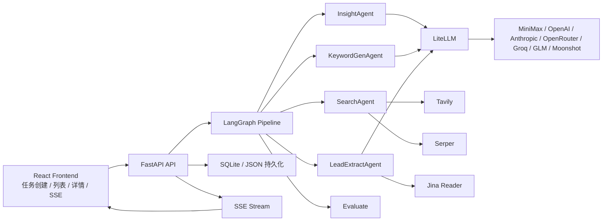
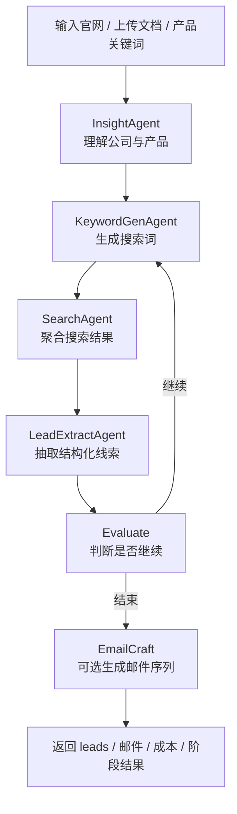

# AI Hunter

> 面向外贸与 B2B 场景的自动化客户挖掘系统，基于 FastAPI、LangGraph、多 Agent 流水线与可配置多模型能力。

[](https://python.org)
[](https://fastapi.tiangolo.com)
[](https://react.dev)
[](https://github.com/langchain-ai/langgraph)

AI Hunter 是一个面向外贸与 B2B 线索挖掘场景的开源版项目。你只需要提供公司官网、产品文档或产品关键词，再指定目标市场，系统就会自动完成公司理解、关键词生成、网页搜索、线索提取和联系方式发现。

## 官方链接

- 官网：https://b2binsights.io/
- 视频介绍：https://www.bilibili.com/video/BV1AzwYzXEGD/?spm_id_from=333.1387.list.card_archive.click
- 开源仓库：https://github.com/xiongQvQ/AI_Find_Customer

## 开源仓库范围

这次公开的开源仓库只保留以下内容：

- `backend/`：FastAPI + LangGraph 主服务
- `frontend/`：React + Vite 前端
- 必要的配置示例和文档

以下模块不进入公开仓库：

- `license-server/`
- `license-server-v2/`
- `landing/`

## 当前版本边界

当前开源版已经开放“客户挖掘 + 邮件草稿生成 + 邮件发送配置”主链路，但仍有一些边界：

- 邮件自动发送建议通过 `campaign / scheduler` 链路使用，不建议把详情页当成完整营销自动化系统
- 邮件发送依赖你自己配置 SMTP / IMAP、授权码与安全策略，仓库不会提供任何第三方邮箱账号
- 非本机访问 API 时，如果没有配置 `API_ACCESS_TOKEN`，接口默认只允许 localhost 访问

## 功能特性

- 多 Agent 流水线：`Insight -> KeywordGen -> Search -> LeadExtract -> Evaluate`
- 双模型协作：推理模型负责 ReAct 决策，普通模型负责抽取、生成与改写
- 输入灵活：支持官网 URL、PDF/Excel/CSV/Word/Markdown/TXT 等文件、或纯关键词
- 多搜索通道：Google Search、Google Maps、B2B 平台站内搜索
- 智能抓取：针对官网、B2B 列表页、内容页等不同 URL 自适应抓取策略
- 联系方式发现：支持提取邮箱、电话、地址、社媒链接等结构化信息
- AI 邮件生成：可基于 ICP、官网洞察与历史邮件样例生成 3 步开发信序列
- 邮件预览与审核：支持在详情页预览生成邮件、人工批准/拦截、手动发送与回信检测
- 邮件自动发送：支持把已批准邮件序列创建为 campaign，并通过 scheduler 持久化发送
- 实时进度流：FastAPI + SSE 推送任务进展，前端实时展示各阶段状态
- 成本可观测：接入 Langfuse 后可记录 LLM 调用成本、Token 与延迟
- 可替换模型：统一通过 LiteLLM 接入 OpenAI、Anthropic、OpenRouter、Groq、GLM、Moonshot、MiniMax
- 继续挖掘参数可控：支持设置目标线索数、最大轮数、每轮最少新增线索阈值

## 架构图



## 工作流



当前停止逻辑由以下参数控制：

- `target_lead_count`：目标线索总数
- `max_rounds`：最多迭代轮数
- `min_new_leads_threshold`：单轮最少新增线索数

这个版本已经修正了“目标线索数设为 200 时，系统因隐藏动态阈值而过早停止”的问题。现在会按你显式配置的 `min_new_leads_threshold` 来判断是否继续。

## 邮件能力

当前版本的邮件链路分成 3 层：

1. 线索挖掘完成后，可选开启 `AI 邮件生成`
2. 在任务详情页中预览、审核、手动发送、手动查回信
3. 把已批准的邮件序列创建为 `campaign`，再进入自动发送 / 自动回信检测

### 邮件生成

- 新建任务或继续挖掘时可以开启 `AI 邮件生成`
- 可以不提供模板，系统会自动生成模板策略和 3 步英文开发信
- 也可以提供历史邮件样例与备注，系统会先提取你的风格再生成
- 生成结果会包含：
  - `template_profile`
  - `template_plan`
  - `validation_summary`
  - `review_summary`

### 邮件预览与审核

- 任务详情页支持预览每一组邮件序列
- 可查看主题、正文、模板来源、生成模式、验证状态、review 问题、模板表现
- 可人工：
  - 批准草稿
  - 拦截草稿
  - 手动发送单封邮件
  - 手动检查回信

### 自动发送与 campaign

- 自动发送不再依赖任务详情页里的临时内存队列
- 正确做法是：
  1. 先完成邮件生成
  2. 只把已批准 / 可发送的序列创建为 `campaign`
  3. 启动 campaign
  4. 由后端 scheduler 持久化发送

### SMTP / IMAP 与授权码

邮件发送前，需要在前端 `Settings` 页面或 `backend/.env` 中配置邮箱参数。

如果你希望直接在浏览器里保存这些配置，需要先开启：

- `SETTINGS_API_ENABLED=true`

最少需要准备：

- `EMAIL_FROM_ADDRESS`
- `EMAIL_SMTP_HOST`
- `EMAIL_SMTP_PORT`
- `EMAIL_SMTP_USERNAME`
- `EMAIL_SMTP_PASSWORD`

如果要自动检测回信，还需要：

- `EMAIL_IMAP_HOST`
- `EMAIL_IMAP_PORT`
- `EMAIL_IMAP_USERNAME`
- `EMAIL_IMAP_PASSWORD`

注意：

- 很多邮箱服务商不允许直接使用登录密码，而是需要在邮箱后台开启 `IMAP / SMTP`
- 通常还要生成 `应用密码`、`客户端授权码` 或 `第三方客户端授权码`
- 必须先在 `Settings` 页面测试 SMTP / IMAP 连接成功，系统才允许开启自动发送和自动回信检测
- 当前设置页已内置常见国内邮箱服务商模板，包括：
  - QQ 邮箱
  - 腾讯企业邮箱
  - 网易 163 / 126
  - 网易企业邮箱
  - 阿里云企业邮箱
  - 手动填写

## 项目结构

```text
AI_Find_Customer/
├── backend/                # FastAPI + LangGraph 主服务
│   ├── agents/             # 各类 Agent
│   ├── api/                # 路由、SSE、持久化接口
│   ├── config/             # 配置读取
│   ├── graph/              # StateGraph 与流程控制
│   ├── tools/              # 搜索、抓取、LLM、解析工具
│   ├── observability/      # Langfuse 等观测能力
│   └── tests/              # pytest 测试
├── frontend/               # React 前端
├── README.md
└── .gitignore
```

## 环境要求

- Python `3.11+`
- Node.js `18+` 或 Bun
- 至少一个 LLM API Key
- 至少一个搜索 API Key

## 快速开始

### 1. 克隆仓库

```bash
git clone https://github.com/xiongQvQ/AI_Find_Customer.git
cd AI_Find_Customer
```

### 2. 启动后端

```bash
cd backend
python3 -m venv .venv
source .venv/bin/activate
pip install --upgrade pip
pip install -r requirements.txt
cp .env.example .env
uvicorn api.app:app --host 127.0.0.1 --port 8000
```

后端默认地址：

- API：`http://127.0.0.1:8000`
- Swagger：`http://127.0.0.1:8000/docs`

### 3. 启动前端

```bash
cd frontend
bun install
bun run dev
```

前端默认地址：

- `http://localhost:3000`

## 配置文件放哪里

所有运行时密钥与邮件参数都放在 `backend/.env`，也可以通过前端 `Settings` 页面保存。

正确做法：

1. 复制 `backend/.env.example` 为 `backend/.env`
2. 在 `backend/.env` 内填写模型、搜索、邮件相关配置
3. 不要把密钥写进前端代码
4. 如果要使用前端 `Settings` 页面在线保存，请在 `.env` 中额外设置 `SETTINGS_API_ENABLED=true`
5. 前端 `Settings` 页面保存的内容会写回后端 `.env`

常见邮件相关变量示例：

```env
EMAIL_FROM_NAME=Your Company
EMAIL_FROM_ADDRESS=sales@example.com
EMAIL_REPLY_TO=sales@example.com
EMAIL_SMTP_HOST=smtp.exmail.qq.com
EMAIL_SMTP_PORT=465
EMAIL_SMTP_USERNAME=sales@example.com
EMAIL_SMTP_PASSWORD=your-app-password
EMAIL_IMAP_HOST=imap.exmail.qq.com
EMAIL_IMAP_PORT=993
EMAIL_IMAP_USERNAME=sales@example.com
EMAIL_IMAP_PASSWORD=your-app-password
EMAIL_USE_TLS=true
EMAIL_AUTO_SEND_ENABLED=false
EMAIL_REPLY_DETECTION_ENABLED=false
EMAIL_LLM_MODEL=minimax/MiniMax-M2.1-highspeed
EMAIL_REASONING_MODEL=minimax/MiniMax-M2.5
EMAIL_LLM_REQUESTS_PER_MINUTE=60
EMAIL_REASONING_REQUESTS_PER_MINUTE=30
EMAIL_REQUIRE_APPROVAL_BEFORE_SEND=true
EMAIL_OPENAI_API_KEY=
EMAIL_ANTHROPIC_API_KEY=
EMAIL_OPENROUTER_API_KEY=
EMAIL_GROQ_API_KEY=
EMAIL_ZAI_API_KEY=
EMAIL_MOONSHOT_API_KEY=
EMAIL_MINIMAX_API_KEY=
```

如果你担心 `MiniMax` 的 RPM 被搜索主链路和邮件链路一起打满，建议单独配置：

- `EMAIL_LLM_MODEL`
- `EMAIL_REASONING_MODEL`
- `EMAIL_LLM_REQUESTS_PER_MINUTE`
- `EMAIL_REASONING_REQUESTS_PER_MINUTE`

这样邮件生成、自动修复、邮件 ReAct 会走单独模型和单独限速，不会和主流程抢同一个默认模型额度。

如果你希望邮件链路连 API Key 都彻底独立，还可以额外配置：

- `EMAIL_OPENAI_API_KEY`
- `EMAIL_ANTHROPIC_API_KEY`
- `EMAIL_OPENROUTER_API_KEY`
- `EMAIL_GROQ_API_KEY`
- `EMAIL_ZAI_API_KEY`
- `EMAIL_MOONSHOT_API_KEY`
- `EMAIL_MINIMAX_API_KEY`

设置后，邮件链路会优先使用这些专用 Key；留空时才回退到主链路的 Key。

## 支持的输入与上传限制

支持输入：

- 官网 URL
- 产品关键词
- 目标客户画像
- 目标地区
- 上传文件作为补充语料

当前后端允许上传的文件类型：

- `.txt`
- `.md`
- `.pdf`
- `.docx`
- `.doc`
- `.xlsx`
- `.xls`
- `.csv`
- `.json`

默认单文件大小限制：

- `50 MB`

## 推荐默认模型

推荐优先使用 **MiniMax**，因为当前代码里已经完整支持：

- `MINIMAX_API_KEY`
- `MINIMAX_API_BASE`
- LiteLLM provider 适配
- `reasoning_model` 与 `llm_model` 分开配置

推荐起步配置：

```env
LLM_MODEL=minimax/MiniMax-M2.1-highspeed
REASONING_MODEL=minimax/MiniMax-M2.5
MINIMAX_API_KEY=your-minimax-key
MINIMAX_API_BASE=https://api.minimax.io/v1
```

如果你要长期跑无界面自动外呼，推荐把邮件链路单独拆出去，例如：

```env
LLM_MODEL=minimax/MiniMax-M2.1-highspeed
REASONING_MODEL=minimax/MiniMax-M2.5
EMAIL_LLM_MODEL=openrouter/google/gemini-flash-1.5
EMAIL_REASONING_MODEL=openrouter/deepseek/deepseek-r1
```

这样主链路继续跑 MiniMax，邮件生成和修复走另一套模型，不会互相卡 RPM。

`MINIMAX_API_BASE` 说明：

- 国际站默认：`https://api.minimax.io/v1`
- 中国大陆可选：`https://api.minimaxi.com/v1`
- 如果你不确定，先使用 `https://api.minimax.io/v1`

## 无界面部署到 VPS

如果你不需要前端界面，只想在 VPS 上持续执行“挖掘 -> 生成邮件 -> 自动发送”，推荐拆成两个常驻进程：

- `API 服务`：负责 hunt、邮件生成、campaign API、发送 scheduler、回信检测
- `Worker 服务`：负责不断创建新 hunt，达到目标线索数后自动创建并启动 campaign

这套结构本质上就是生产者-消费者：

- 生产者：`backend/scripts/headless_worker.py` 持续创建新的 hunt
- 消费者：`api.app` 内置的 `EmailScheduler` 后台循环负责发送 pending 邮件

### 自动任务配置

```bash
cd backend
cp automation_job.example.json automation_job.json
```

然后编辑 `automation_job.json`。如果你希望“每次挖到 100 个就发邮件”，把：

```json
"target_lead_count": 100
```

### 启动 API

```bash
cd backend
source .venv/bin/activate
uvicorn api.app:app --host 0.0.0.0 --port 8000
```

### 启动 headless worker

```bash
cd backend
source .venv/bin/activate
python scripts/headless_worker.py \
  --payload-file ./automation_job.json \
  --continuous \
  --auto-start-campaign \
  --cycle-interval-seconds 60 \
  --status-poll-seconds 15
```

如果你想跳过人工审核，直接放行 `needs_review` 的邮件序列，可以在 `.env` 中设置：

```env
EMAIL_REQUIRE_APPROVAL_BEFORE_SEND=false
```

### systemd 常驻

仓库已经提供 systemd 示例文件：

- [deploy/systemd/ai-hunter-api.service](/Users/xiongbojian/work/opensource/AI_Find_Customer/deploy/systemd/ai-hunter-api.service)
- [deploy/systemd/ai-hunter-worker.service](/Users/xiongbojian/work/opensource/AI_Find_Customer/deploy/systemd/ai-hunter-worker.service)

把里面的 `/opt/ai-hunter/backend` 改成你 VPS 的实际路径后：

```bash
sudo cp deploy/systemd/ai-hunter-api.service /etc/systemd/system/
sudo cp deploy/systemd/ai-hunter-worker.service /etc/systemd/system/
sudo systemctl daemon-reload
sudo systemctl enable --now ai-hunter-api
sudo systemctl enable --now ai-hunter-worker
```

## API Key 申请入口与填写方式

### 1. MiniMax

官方入口：

- 平台入口：https://platform.minimaxi.com/
- 官方文档：https://platform.minimaxi.com/document

建议流程：

1. 注册并登录 MiniMax 平台
2. 进入控制台后创建或查看 API Key
3. 把 Key 填到 `backend/.env` 的 `MINIMAX_API_KEY`
4. 设置 `LLM_MODEL` 和 `REASONING_MODEL`

示例：

```env
LLM_MODEL=minimax/MiniMax-M2.1-highspeed
REASONING_MODEL=minimax/MiniMax-M2.5
MINIMAX_API_KEY=your-minimax-key
MINIMAX_API_BASE=https://api.minimax.io/v1
```

### 2. Tavily

官方入口：

- 产品主页：https://tavily.com/
- 文档入口：https://docs.tavily.com/
- 控制台入口：https://app.tavily.com/

这个项目支持多个 Tavily Key 直接写到一个环境变量里，后端会按英文逗号拆分并轮询使用。

建议流程：

1. 注册并登录 Tavily
2. 在控制台创建 API Key
3. 至少准备 `2-3` 个 Key
4. 直接写进 `TAVILY_API_KEY`，中间用英文逗号连接，不要加空格

示例：

```env
TAVILY_API_KEY=tvly-dev-xxx,tvly-prod-yyy,tvly-prod-zzz
```

### 3. Serper

官方入口：

- 产品主页：https://serper.dev/

`SERPER_API_KEY` 在这个项目里主要承担：

- Google Search 补充搜索
- Google Maps 搜索

示例：

```env
SERPER_API_KEY=your-serper-key
```

### 4. Jina Reader

官方入口：

- 产品主页：https://jina.ai/
- Reader 说明：https://jina.ai/reader/

`JINA_API_KEY` 用于网页抓取与正文读取。

示例：

```env
JINA_API_KEY=your-jina-key
```

### 5. Langfuse（可选）

官方入口：

- 产品主页：https://langfuse.com/
- Cloud：https://cloud.langfuse.com/
- 文档：https://langfuse.com/docs

如果你想看每次 LLM 调用的 Token、成本、时延，可以开启：

```env
LANGFUSE_ENABLED=true
LANGFUSE_PUBLIC_KEY=your-public-key
LANGFUSE_SECRET_KEY=your-secret-key
LANGFUSE_HOST=https://cloud.langfuse.com
```

## 最小可运行配置

```env
LLM_MODEL=minimax/MiniMax-M2.1-highspeed
REASONING_MODEL=minimax/MiniMax-M2.5
MINIMAX_API_KEY=your-minimax-key
MINIMAX_API_BASE=https://api.minimax.io/v1

SERPER_API_KEY=your-serper-key
TAVILY_API_KEY=tvly-key-1,tvly-key-2
JINA_API_KEY=your-jina-key
```

## 关键配置项说明

| 变量名 | 作用 | 默认建议 |
| --- | --- | --- |
| `LLM_MODEL` | 常规抽取/生成模型 | `minimax/MiniMax-M2.1-highspeed` |
| `REASONING_MODEL` | ReAct 决策模型 | `minimax/MiniMax-M2.5` |
| `MINIMAX_API_KEY` | MiniMax 密钥 | 必填 |
| `TAVILY_API_KEY` | 通用网页搜索，支持多个 key | 建议至少 2 个 |
| `SERPER_API_KEY` | Google / Google Maps 搜索 | 建议配置 |
| `JINA_API_KEY` | 网页正文抓取 | 建议配置 |
| `DEFAULT_TARGET_LEAD_COUNT` | 默认目标线索数 | `200` |
| `DEFAULT_MAX_ROUNDS` | 默认最大轮数 | `10` |
| `MIN_NEW_LEADS_THRESHOLD` | 每轮最少新增线索阈值 | `5` |
| `API_ACCESS_TOKEN` | 非本机访问时的接口令牌 | 生产环境建议设置 |
| `SETTINGS_API_ENABLED` | 是否启用前端 Settings 在线保存 | 想用浏览器配置时设为 `true` |

## 前后端联调说明

- 前端默认通过 Vite 代理把 `/api` 转发到 `http://localhost:8000`
- 如果后端配置了 `API_ACCESS_TOKEN`，前端需要额外设置 `VITE_API_ACCESS_TOKEN`
- 未配置 `API_ACCESS_TOKEN` 时，后端只允许 localhost 访问，远程机器访问会返回 `403`

## 常用接口

- `POST /api/v1/upload`：上传文件
- `POST /api/v1/hunts`：创建新的客户挖掘任务
- `GET /api/v1/hunts`：获取任务列表
- `GET /api/v1/hunts/{hunt_id}/status`：查看任务状态
- `GET /api/v1/hunts/{hunt_id}/result`：查看任务结果
- `GET /api/v1/hunts/{hunt_id}/cost`：查看成本统计
- `GET /api/v1/hunts/{hunt_id}/stream`：SSE 实时进度流
- `POST /api/v1/hunts/{hunt_id}/resume`：继续挖掘
- `GET /api/v1/health`：健康检查

## 常见问题

### 1. 为什么我把最大返回线索数设成 200，任务却提前停了？

看三个参数：

- `target_lead_count`
- `max_rounds`
- `min_new_leads_threshold`

当前逻辑会在以下任一条件满足时结束：

- 已达到目标线索数
- 已达到最大轮数
- 单轮新增线索数低于你配置的 `min_new_leads_threshold`

这个版本已经修正了“隐藏动态阈值导致过早停止”的问题。

### 2. 为什么前端 Settings 页面保存不了配置？

先检查 `backend/.env` 里是否开启了：

```env
SETTINGS_API_ENABLED=true
```

如果这个开关没开，前端设置页可以展示，但后端不会挂载设置保存接口。

### 3. 为什么我已经配置了 SMTP / IMAP，还是不能自动发送或自动查回信？

因为现在不是“填了参数就算可用”，还要求你在 `Settings` 页面里先测试连接成功：

- 自动发送依赖 SMTP 测试成功
- 自动回信检测依赖 IMAP 测试成功
- 只生成邮件草稿和预览，不依赖 SMTP / IMAP

## 常用开发命令

### Backend

```bash
cd backend
python -m pytest tests/ -q
python -m pytest tests/ --cov=. --cov-report=term-missing
uvicorn api.app:app --reload --port 8000
```

### Frontend

```bash
cd frontend
bun install
bun run dev
bun run build
```

## 深度检查后补充的文档点

这次按当前代码实现补上了几个以前容易漏掉的关键点：

- `Settings` 页面已经是实际配置入口，但需要 `SETTINGS_API_ENABLED=true`
- 非 localhost 访问默认需要 `API_ACCESS_TOKEN`
- Tavily 支持多 Key 轮询
- `MIN_NEW_LEADS_THRESHOLD` 已支持任务级配置
- 邮件链路已经开放到“生成 / 预览 / 审核 / campaign 自动发送”
- 自动发送与自动回信检测都要求先完成邮箱测试
- Langfuse 的接入方式和环境变量说明

## 适用场景

- 外贸工厂找海外经销商、批发商、渠道商
- SaaS 或 B2B 服务公司寻找潜在客户
- 根据产品资料自动反推目标客户画像与搜索词
- 针对特定国家或区域进行批量线索挖掘

## License

本项目采用 [MIT License](LICENSE)。
