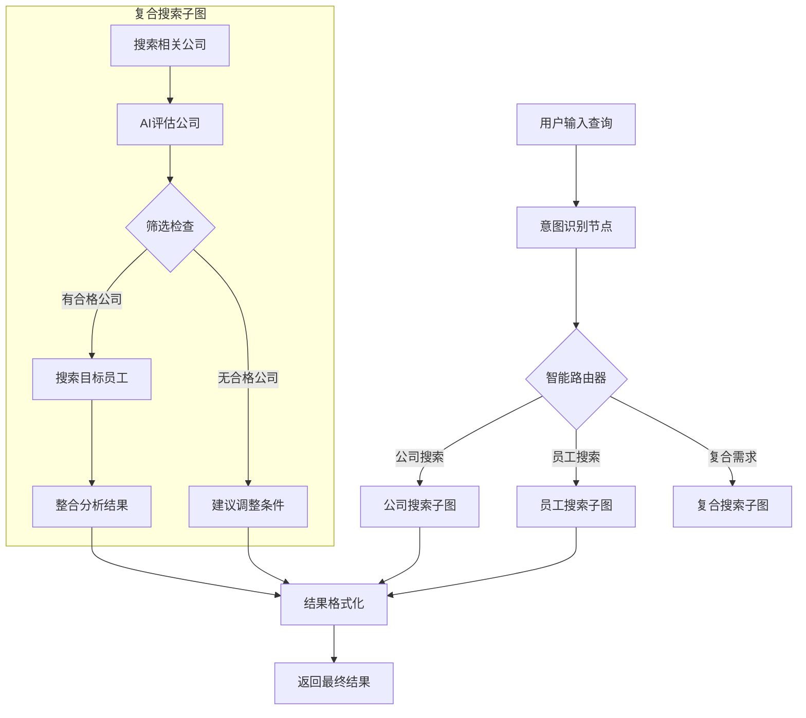

# LangGraph智能搜索升级技术方案

## 📋 项目概述

### 当前问题
- 现有智能搜索系统只支持公司搜索
- 缺少意图识别，无法理解用户真实需求
- 无法处理复合搜索需求（先搜公司再搜员工）
- 工作流固化，无法根据中间结果动态调整策略

### 目标需求
1. **意图识别**：自动判断用户是要搜索公司、员工还是复合需求
2. **复合工作流**：支持"搜索公司 → AI评估筛选 → 基于符合条件公司搜索员工"
3. **动态路由**：根据意图和中间结果选择不同的执行路径
4. **状态管理**：在复杂工作流中维护和传递状态信息

## 🏗 技术架构

### 核心技术选择：LangGraph

**选择理由：**
- 🎯 **强大的流程控制**：原生支持条件分支、循环、人工介入
- 📊 **显式状态管理**：集中式状态管理，任何节点都可访问/修改
- 🔍 **可观测性**：流程可视化，便于调试复杂工作流
- 🔄 **动态路由**：根据状态内容决定下一个执行节点
- 🚀 **扩展性**：易于添加新的搜索类型和处理逻辑

### 系统架构图



## 📊 状态管理设计

### 核心State Schema

```python
class SearchState(TypedDict):
    # 用户输入层
    user_query: str                    # 原始用户查询
    
    # 意图识别层
    intent: str                        # "company", "employee", "composite"
    confidence: float                  # 意图识别置信度
    entities: Dict[str, Any]          # 提取的结构化实体
    
    # 搜索条件层
    company_criteria: Optional[Dict]   # 公司搜索条件
    employee_criteria: Optional[Dict]  # 员工搜索条件
    filter_threshold: float           # 筛选阈值
    
    # 执行结果层
    company_results: List[Dict]       # 公司搜索结果
    company_assessments: List[Dict]   # AI评估结果
    qualified_companies: List[Dict]   # 筛选后的合格公司
    employee_results: List[Dict]      # 员工搜索结果
    
    # 输出层
    final_results: List[Dict]         # 最终整合结果
    execution_summary: Dict           # 执行统计信息
    
    # 控制层
    current_step: str                 # 当前执行步骤
    error_info: Optional[Dict]        # 错误信息
    next_action: Optional[str]        # 下一步动作
```

## 🔧 核心节点设计

### 1. 意图识别节点 (Intent Recognition)

**功能**：
- 分析用户查询，识别搜索意图
- 提取关键实体（产品、地区、职位、公司等）
- 生成结构化的搜索条件

**输入示例**：
```
"找深圳地区做新能源汽车的公司的采购负责人联系方式"
```

**输出结果**：
```python
{
    "intent": "composite",
    "confidence": 0.92,
    "entities": {
        "location": "深圳",
        "industry": "新能源汽车", 
        "target_role": "采购负责人",
        "contact_type": "联系方式"
    }
}
```

### 2. 智能路由器 (Smart Router)

**功能**：
- 根据意图识别结果选择执行路径
- 支持条件分支逻辑
- 处理边缘情况和错误路由

**路由规则**：
- `intent == "company"` → 公司搜索子图
- `intent == "employee"` → 员工搜索子图  
- `intent == "composite"` → 复合搜索子图
- `confidence < 0.7` → 意图澄清节点

### 3. 公司搜索节点 (Company Search)

**功能**：
- 集成现有的Serper公司搜索功能
- 支持多种搜索策略（通用搜索、LinkedIn搜索）
- 返回结构化的公司信息

**复用现有代码**：
```python
# 封装现有功能
def search_companies_node(state: SearchState) -> SearchState:
    criteria = state["company_criteria"]
    
    # 调用现有的serper_company_search逻辑
    results = execute_company_search(criteria)
    
    state["company_results"] = results
    state["current_step"] = "company_search_completed"
    return state
```

### 4. AI评估节点 (AI Assessment)

**功能**：
- 使用LLM对搜索到的公司进行智能评分
- 根据用户需求匹配度打分
- 支持多维度评估（行业匹配、规模、地域等）

**集成现有AI分析器**：
```python
def assess_companies_node(state: SearchState) -> SearchState:
    companies = state["company_results"]
    target_profile = state["entities"].get("target_profile")
    
    # 使用现有的StreamlitCompatibleAIAnalyzer
    analyzer = StreamlitCompatibleAIAnalyzer()
    assessments = analyzer.batch_analyze_companies(companies, target_profile)
    
    state["company_assessments"] = assessments
    return state
```

### 5. 员工搜索节点 (Employee Search)

**功能**：
- 基于筛选后的公司搜索目标员工
- 集成现有的员工搜索功能
- 支持多种员工搜索策略

**实现方式**：
```python
def search_employees_node(state: SearchState) -> SearchState:
    qualified_companies = state["qualified_companies"]
    employee_criteria = state["employee_criteria"]
    
    all_employees = []
    for company in qualified_companies:
        # 使用现有的serper_employee_search功能
        employees = search_company_employees(
            company["name"], 
            employee_criteria["position"]
        )
        all_employees.extend(employees)
    
    state["employee_results"] = all_employees
    return state
```

### 6. 结果整合节点 (Result Integration)

**功能**：
- 整合公司和员工搜索结果
- 生成综合分析报告
- 排序和优化展示结果

## 🔄 工作流路径详解

### 路径1：纯公司搜索
```
用户输入 → 意图识别 → 路由(公司) → 公司搜索 → 结果格式化 → 输出
```

**示例**：
- 输入："找做太阳能的公司"
- 意图：company
- 执行：搜索太阳能相关公司 → 返回公司列表

### 路径2：纯员工搜索
```
用户输入 → 意图识别 → 路由(员工) → 员工搜索 → 结果格式化 → 输出
```

**示例**：
- 输入："找华为的销售经理联系方式"
- 意图：employee
- 执行：在华为搜索销售经理 → 返回员工信息

### 路径3：复合搜索（核心创新）
```
用户输入 → 意图识别 → 路由(复合) → 公司搜索 → AI评估 → 筛选检查 
    ↓
筛选通过 → 员工搜索 → 结果整合 → 输出
    ↓
筛选不通过 → 建议调整 → 输出
```

**示例**：
- 输入："找深圳新能源公司的采购负责人"
- 意图：composite
- 执行流程：
  1. 搜索深圳新能源公司
  2. AI评估公司匹配度
  3. 筛选评分>80的公司
  4. 在筛选后公司中搜索采购负责人
  5. 整合公司+员工信息返回

## 🔌 现有系统集成策略

### 1. API层复用
- **Serper搜索API**：直接复用现有的公司/员工搜索接口
- **AI分析器**：集成StreamlitCompatibleAIAnalyzer
- **数据处理**：复用现有的数据清理和格式化逻辑

### 2. UI层集成
- **Streamlit前端**：在现有智能搜索页面基础上升级
- **进度显示**：复用现有的智能体进度显示组件
- **结果展示**：扩展现有的结果展示组件支持员工信息

### 3. 配置层兼容
- **API密钥**：复用现有的环境变量配置
- **语言支持**：集成现有的多语言管理系统
- **缓存机制**：复用现有的缓存策略

## 📈 性能优化策略

### 1. 并行执行
- 在复合搜索中，员工搜索可以并行处理多家公司
- AI评估可以批量处理，提高效率

### 2. 智能缓存
- 缓存意图识别结果
- 缓存公司AI评估结果
- 缓存常见查询的完整结果

### 3. 早期退出
- 如果AI评估发现所有公司都不符合条件，提前结束流程
- 意图识别置信度过低时，引导用户澄清需求

## 🚨 风险评估与应对

### 技术风险
**风险**：LangGraph学习曲线较陡峭
**应对**：
- 分阶段实施，先实现简单路径
- 团队技术培训和文档完善
- 保留现有CrewAI系统作为后备方案

### 性能风险
**风险**：复合搜索链路较长，可能影响响应时间
**应对**：
- 实施并行处理优化
- 添加超时和熔断机制  
- 提供进度反馈提升用户体验

### 兼容风险
**风险**：新系统与现有UI/数据格式不兼容
**应对**：
- 设计适配层保证接口兼容
- 渐进式迁移，支持新旧系统并存
- 充分的测试覆盖

## 📝 实施计划

### 第一阶段：核心框架搭建 (1周)
- [ ] 搭建LangGraph基础框架
- [ ] 实现基础State管理
- [ ] 创建意图识别节点
- [ ] 实现简单的路由逻辑

### 第二阶段：功能节点开发 (2周)
- [ ] 集成现有公司搜索功能
- [ ] 集成AI评估功能
- [ ] 开发员工搜索节点
- [ ] 实现结果整合逻辑

### 第三阶段：UI集成与优化 (1周)
- [ ] 升级Streamlit前端界面
- [ ] 集成进度显示和错误处理
- [ ] 性能优化和缓存实现
- [ ] 用户体验优化

### 第四阶段：测试与上线 (1周)
- [ ] 功能测试和性能测试
- [ ] 用户验收测试
- [ ] 监控和日志系统
- [ ] 正式发布

## 🎯 预期收益

### 功能层面
- ✅ 支持3种搜索模式（公司、员工、复合）
- ✅ 意图识别准确率>90%
- ✅ 复合搜索成功率>85%
- ✅ 响应时间<30秒（复合搜索）

### 技术层面
- 🔧 工作流更加灵活和可扩展
- 📊 更好的状态管理和调试能力
- 🚀 为未来更复杂的AI workflow奠定基础
- 💡 提升团队对AI Agent编排的技术能力

### 业务层面
- 📈 用户查询满足度显著提升
- 🎯 更精准的客户线索获取
- ⚡ 从"搜索工具"升级为"智能助手"
- 🌟 产品竞争力和用户粘性增强

---

**文档版本**: v1.0  
**更新时间**: 2024年12月  
**负责人**: AI开发团队  
**审核状态**: 待评审